# Aquarius 🐟

Aquarium monitoring system with both a PC dashboard and a VR interface for visualizing fish positions, sensor data, and tank images.

## Components

- `backend`: Python (FastAPI) that processes camera captures and integrates with multiple AI apis.
- `robot`: Python (MyCobot280PI) that controls the robotic arm.
- `frontend-pc`: React-based dashboard for real-time monitoring of tank status.
- `frontend-vr`: A-Frame VR application for visualizing the aquarium in mixed reality.

## Usage

Uses docker compose, all config stored in `.env` file. Make sure to add API keys for OpenAI, Gemini, Claude.

Use the scripts in `scripts` to start the services on the master robot node, then access dashboards on pc/mobile/vr.

<!-- ## Video

[](https://www.youtube.com/watch?v=TBD) -->

## Architecture

```mermaid
flowchart LR
    aquarium["🐟 Aquarium"]
    camera["📷 USB Camera"]
    
    subgraph AGX Orin["AGX Orin (192.168.x.x)"]
        backend["Backend\nFastAPI\n:8000"]
        fe_pc["Frontend-PC\nReact\n:3000"]
        fe_vr["Frontend-VR\nA-Frame\n:3001"]
        backend --> fe_pc
        backend --> fe_vr
    end
    
    subgraph Remote Devices
        pc["💻 PC Browser\nSame Network"]
        vr["🥽 VR Browser\nSame Network"]
        phone["📱 Mobile Browser\nSame Network"]
    end
    
    aquarium --> camera
    camera --> backend
    fe_pc -- "HTTP:3000" --> pc
    fe_pc -- "HTTP:3000" --> phone
    fe_vr -- "HTTP:3001" --> vr

    style aquarium fill:#e2f5ff,stroke:#0088cc
    style AGX Orin fill:#f5f5f5,stroke:#666666
    style camera fill:#f9f9f9,stroke:#999999
    style backend fill:#ddfbe7,stroke:#28a745
    style fe_pc fill:#fff3cd,stroke:#ffc107
    style fe_vr fill:#f8d7da,stroke:#dc3545
    style pc fill:#cce5ff,stroke:#0056b3
    style vr fill:#d7d8f8,stroke:#6610f2
    style phone fill:#cce5ff,stroke:#0056b3
```



## Citation

```
@misc{hupo2024aquarius,
  title={Aquarius: AI Aquarium Monitoring},
  author={Hugo Ponte},
  year={2024},
  url={https://github.com/hu-po/aquarius}
}
```